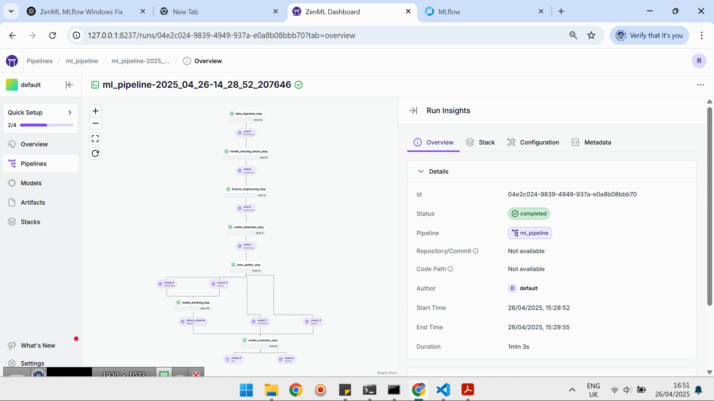

# 📦 End-to-End MLOps Pipeline with ZenML, MLflow, VS Code, and WSL on Windows

This project demonstrates how to develop, evaluate, and deploy a machine learning model using a fully automated MLOps pipeline built with **ZenML** and **MLflow**.
It is specifically set up to work on **Windows 11** using **VS Code Remote-WSL** and **Ubuntu** under WSL 2.

**We automate:**
-- Data ingestion ➔ Preprocessing ➔ Model training ➔ Evaluation ➔ Deployment
with artifact tracking and service orchestration.

## 🎥 Project Demo Video

Watch the walkthrough of this project on LinkedIn:

[](https://www.linkedin.com/posts/raz-yousufi-7706322a3_ml-mlops-zenml-activity-7321932703661002752-r8rV?utm_source=share&utm_medium=member_desktop&rcm=ACoAAEk9_MQBNO2Hr48sSzDGlY5NnwqtWGq-vhQ)


---

## 🛠️ Project Structure

```
House-prices-predict-MLOps/
├── .venv/                # Virtual environment
├── .zen/                 # ZenML metadata
├── analysis/             # Exploratory data analysis
├── data/                 # Source of data
├── design_patterns/      # Reusable MLOps design patterns
├── extracted_data/       # Extracted raw dataset(s)
├── mlruns/               # MLflow experiment tracking
├── pipelines/            # ZenML pipelines definitions
├── src/                  # Core code (feature engineering, model building, etc.)
├── steps/                # Individual ZenML steps
├── tests/                # Unit and integration tests
├── config.yaml           # Project configuration file
├── README.md             # Project documentation
├── requirements.txt      # Project dependencies
├── run_pipeline.py       # Script to run the training pipeline
├── run_deployment.py     # Script to deploy the best model
├── sample_predict.py     # Script to test prediction after deployment
```

---

## ⚙️ How to Set Up the Project

Follow these steps carefully to reproduce the MLOps environment and workflow.

### 1. Install WSL and Ubuntu on Windows 11

- Open **PowerShell** (as Admin):
  ```bash
  wsl --install
  ```
- Ensure you have **Ubuntu 22.04 LTS** installed.
- Verify WSL version:
  ```bash
  wsl --list --verbose
  ```
  Ensure it's **WSL 2**.

---

### 2. Set Up VS Code Remote WSL

- Open **VS Code** by opening the WSL (Start Menu > type WSL > open):
  -- Go to your project folder/directory (e.g., cd mct/F/AI/MLOps/prices-predict-mlops)
  -- Type the command: ` code .`

- Install the **Remote - WSL** extension in VS Code.
- Open **VS Code**, press `Ctrl+Shift+P`, select **"Remote-WSL: New Window"**.

---

### 3. Prepare Python Environment Inside WSL

- Update and install essentials:
  ```bash
    sudo apt update
    sudo apt install python3.10 python3.10-venv python3-pip
  ```

---

### 4. Clone This Repository

Inside WSL terminal:

```bash
git clone https://github.com/razyousuf/MLOps.git
cd MLOps
```

---

### 5. Create a Virtual Environment

```bash
    python3.10 -m venv .venv
    source .venv/bin/activate
```

---

### 6. Install Python Dependencies

```bash
    pip install --upgrade pip
    pip install -r requirements.txt
```

> **Note:**
> If you see `externally-managed-environment` error, make sure you are inside your virtual environment.

---

### 7. Initialize and Set Up ZenML

```bash
zenml init
```

This creates the `.zen` directory and a local ZenML repository.

---

### 8. ZenML Stack Configuration

This project requires a ZenML stack with MLflow components. Here's how to set it up:

a. Install Required Integrations:

```bash
zenml integration install mlflow -y
```

b. Register MLflow Components:

```bash
# Register MLflow Experiment Tracker
zenml experiment-tracker register mlflow_tracker --flavor=mlflow

# Register MLflow Model Deployer
zenml model-deployer register mlflow --flavor=mlflow
```

c. Create and Activate Stack:

```bash
zenml stack register local-mlflow-stack \
  -a default \          # Artifact Store
  -o default \          # Orchestrator
  -d mlflow \           # Model Deployer
  -e mlflow_tracker \   # Experiment Tracker
  --set                 # Activate immediately
```

d. Verify Your Stack:

```bash
zenml stack describe
```

---

### 9. Run the ZenML:

```bash
zenml up --blocking
```

Or manually register your custom stack if needed.

---

### 10. Execute the pipeline:

```bash
python run_pipeline.py
```

- **Steps included**:
  ## 🧩 Steps Directory Breakdown

Each step is a ZenML `@step` that encapsulates a single stage of the pipeline:

| Step File                       | Purpose                                                |
| ------------------------------- | ------------------------------------------------------ |
| `data_ingestion_step.py`        | Load raw dataset into memory                           |
| `data_splitter_step.py`         | Split dataset into training/validation/test sets       |
| `dynamic_importer.py`           | Dynamically import external datasets during deployment |
| `feature_engineering_step.py`   | Apply feature transformations (encoding, scaling)      |
| `handle_missing_values_step.py` | Impute or handle missing data                          |
| `model_building_step.py`        | Train ML models (XGBoost, RandomForest)                |
| `model_evaluator_step.py`       | Evaluate model performance                             |
| `model_loader.py`               | Load pre-trained models during deployment              |
| `outlier_detection_step.py`     | Detect and handle data outliers                        |
| `prediction_service_loader.py`  | Load prediction service endpoint                       |
| `predictor.py`                  | Send inference requests to deployed model              |

## 🔵 Key Features

- **Modular Design**: Each step is reusable and independent
- **Flexible Swapping**:
  - Change models easily
  - Plug in different feature pipelines
  - Hot-swap deployment methods
- **MLOps Best Practices**:
  - Caching enabled for all steps
  - Automatic experiment tracking
  - Model versioning

> Pipelines automatically log parameters, metrics, and artifacts to MLflow UI.

---

### 11. Access the MLflow Tracking Server

After running the pipeline:

```bash
mlflow ui
```

- Navigate to: `http://127.0.0.1:5000`
- View experiments, parameters, models, and deployment statuses.

---

## ❗ Common Issues and Solutions

|                           Problem                            |                                                    Solution                                                    |
| :----------------------------------------------------------: | :------------------------------------------------------------------------------------------------------------: |
| `Daemon functionality is currently not supported on Windows` |                            Use WSL and run everything inside WSL Linux environment.                            |
|  `externally-managed-environment` error during pip install   |           Always activate your virtual environment created inside WSL (`source .venv/bin/activate`).           |
|    VS Code switches back to Windows when opening folders     | Make sure to **"Open Folder"** inside VS Code's **Remote-WSL** window. Do not open from Windows file explorer. |
|                 MLflow server not accessible                 |                Ensure ports 5000 (MLflow) are open and you are running MLflow from inside WSL.                 |

---

## 📋 Key Tools and Technologies

- **ZenML** — MLOps orchestration and pipeline automation
- **MLflow** — Experiment tracking and model registry
- **VS Code** — Lightweight IDE with WSL remote development
- **WSL 2 (Ubuntu 24.04.1)** — Linux environment on Windows 11
- **Python 3.10.17** — Programming language for ML pipeline
- **Scikit-learn** — Machine Learning library

---

## 🌟 What You Will Learn

- How to fully automate an ML project lifecycle: from development to deployment.
- How to structure your ML codebase for MLOps.
- How to properly set up Python, ZenML, and MLflow in Windows using WSL.
- How to track experiments, models, and metrics through MLflow.

---

## 📌 References

- [ZenML Documentation](https://docs.zenml.io/)
- [MLflow Documentation](https://mlflow.org/docs/latest/index.html)
- [WSL Setup Guide - Microsoft](https://learn.microsoft.com/en-us/windows/wsl/install)
- [VS Code Remote WSL Guide](https://code.visualstudio.com/docs/remote/wsl)

---
